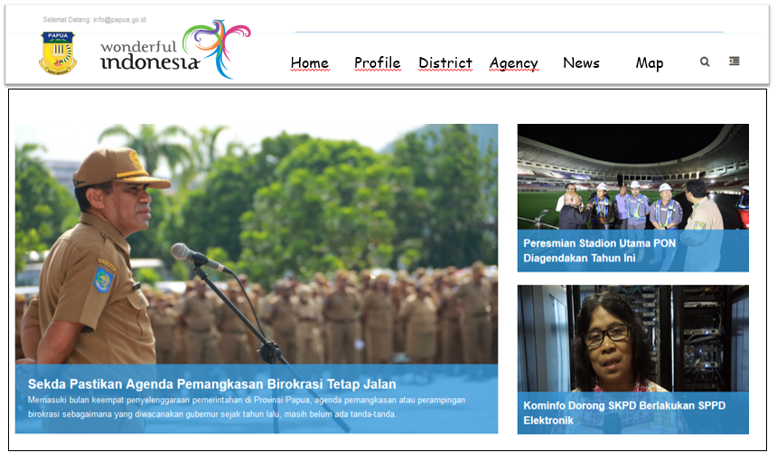
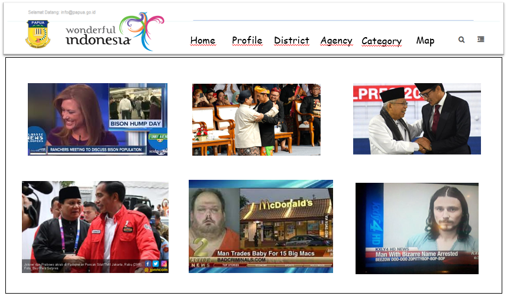
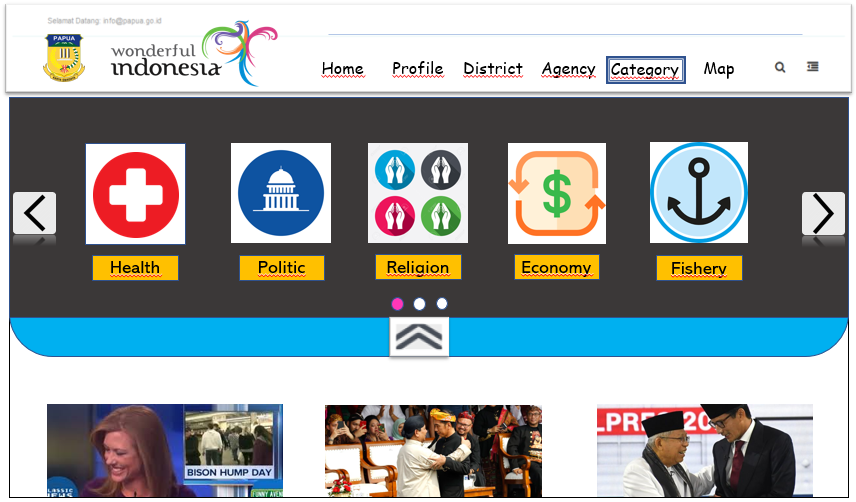
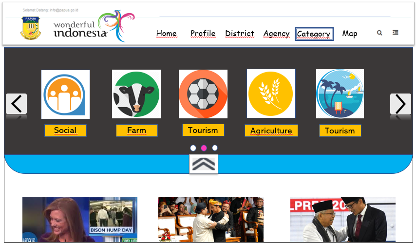
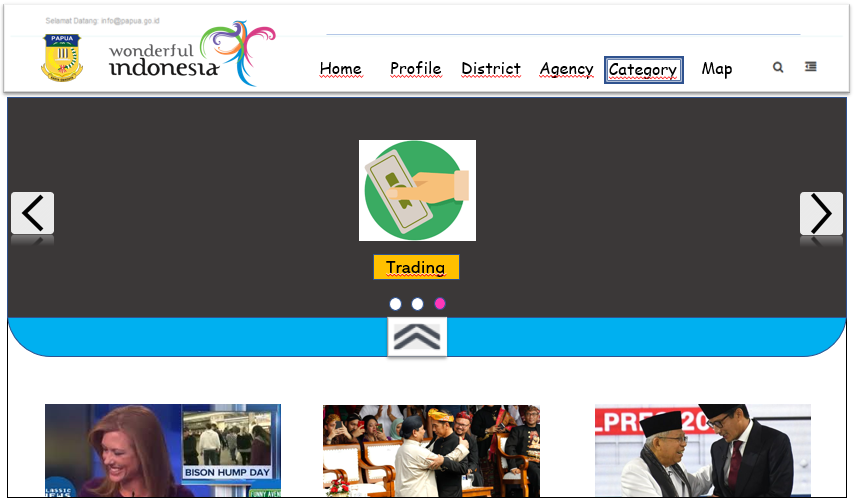
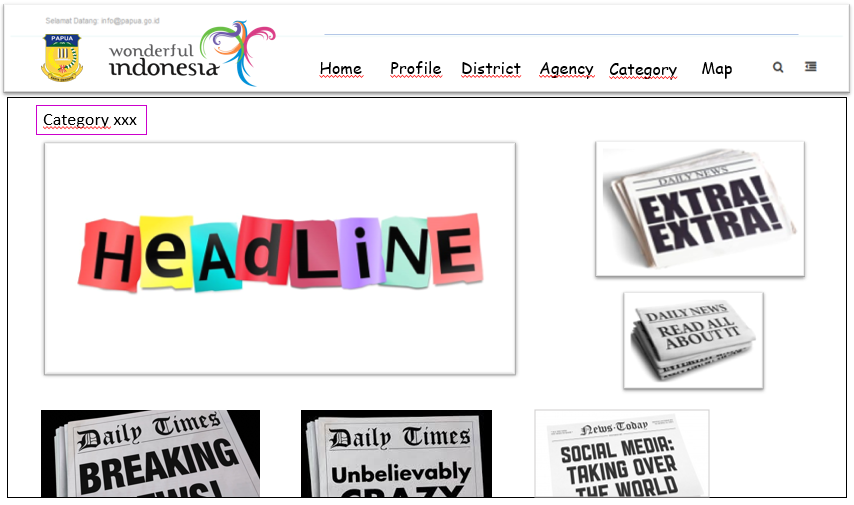

# Assignment - 3
- Puguh Santosa D
- 05111640000049
- Human - Computer Interaction A

# Usability Evaluation and Prototyping (again)
Papua.go.id is a web owned by Papua's goverment. It provides informations regarding the region. From the profiles of its' goverments to administration stuff. From my observation, i spotted some weakness. One of them is the news categorization.

## Operating the Prototype

Click the picture below to see the video

---

## Part A: Usability Evaluation

### 1. Brief Description of Participants

#### a. Description of Participant 1
- Same Contextual Inquiry's Participant from the past
- 20 Years
- A physic student from ITS
- Uses internet often (everyday, everytime)
- Rarely visits goverment's website

#### b. Description of Participant 2
- 21 Years
- An informatics students from ITS
- Uses internet often (usually for chat, soscial media, streaming)
- Seldom(ly) at visiting goverment's web

### 2. Evaluation Script
#### Questions
- How old are you?
- What is your profession?
- How often for you at using the internet?
- What you usually do with internet?
- Have you ever visited/used goverment's web before?

#### Intructions
- Try to find news with category "Trading"
- Try to find news with category "Agriculltural"
- Go to main page

### 3. Transcript

#### a. Transcript with Participant 1
- (**00:00**) **You**        : (Greetings)
- (**00:01**) **Participant**: (Greetings)
- (**00:03**) **You**        : (Menjelaskan bahwa saya membuat prototype dari web sebelumnya dan ingin partisipan mengujinya, dan tidak ada salah atau benar dalam proses berlangsung)
- (**00:52**) **You**        : Berapa umur anda?
- (**00:54**) **Participant**: 20
- (**00:58**) **You**        : Pekerjaan anda?
- (**01:00**) **Participant**: Mahasiswa ITS
- (**01:15**) **You**        : Seberapa sering anda menggunakan internet?    
- (**01:18**) **Participant**: Setiap hari, setiap waktu, setiap detik
- (**01:22**) **You**        : Biasanya menggunakan internet untuk apa?
- (**01:25**) **Participant**: Browsing, main game, youtube, dll
- (**01:39**) **You** : Sebelumnya pernah memakai website pemerintah?
- (**01:46**) **Participant**: Jarang jarang
- (**02:13**) **You** : Coba kamu cari berita dengan kategori Trading
- (**02:19**) **Participant** : (Mulai mengarahkan kursor ke ikon search) (ikon search sebenarnya tidak berfungsi)
- (**02:22**) **Participant** : (Mulai meng-klik "news")
- (**02:25**) **Participant** : (Meng-klik menu category)
- (**02:26**) **Participant** : (Mencari kategori yang dimaksud pada kumpulan pilihan kategori)
- (**02:31**) **Participant** : (Partisipan menemukan berita dengan kategor yang dimaksud)
- (**02:43**) **You** : Coba kamu sekarang cari berita dengan kategori "agrikultural"
- (**02:48**) **Participant** : (Partisipan memilih menu kategori dan memilih kategori yang dimaksud)
- (**02:56**) **Participant** : (Partisipan menemukan berita dengan kategori yang dimaksud)
- (**03:00**) **You** : Sekarang coba ke halaman utama
- (**03:07**) **Participant** : (Partisipan menuju halaman utama dengan mudah)
- (**03:19**) **You** : Overall bagaimana menurutmu?
- (**03:22**) **Participant** : (Menjelaskan kalau secara menyeluruh bagus dan efisien dan mungkin bisa dipercantik dengan menambah ikon pada nama menu)

#### b. Transcript with Participant 2
 - (**00:00**) **You** : (Greetings)
 - (**00:02**) **Participant**: (Greetings)
 - (**00:04**) **You** : (Menjelaskan bahwa saya membuat desain prototype untuk sebuah web dan ingin partisipan untuk mengujinya, serta menjalskan bahwa tidak ada salah dan benar) 
 - (**00:31**) **You** : Umurnya berapa?
 - (**00:36**) **Participant** : 21
 - (**00:37**) **You** : Pekerjaan anda?
 - (**00:39**) **Participant** : Mahasiswi
 - (**00:50**) **You** : Seberapa sering anda menggunakan internet?
 - (**00:53**) **Participant** : Hampir setiap hari, hampir setiap saat kecuali saat tidur
 - (**01:02**) **You** : Biasanya menggunakan internet untuk apa?
 - (**01:04**) **Participant** : Buat nugas, chat, sosmed, nonton
 - (**01:19**) **You** : Sebelumnya pernah mengunjungi/menggunakan website pemerintah?
 - (**01:27**) **Participant** : Kalau memakai jarang, kalau mengunjungi pernah
 - (**02:05**) **You** : Sekarang aku mau kamu coba cari berita dengan kategori "trading"
 - (**02:18**) **Participant** : (Partisipan mengeksplor dengan mudah tetapi saat hendak memilih kategori, ia meng-klik nama kategorinya padahal hanya ikon yang dapat diklik tetapi akhirnya menemukan beritanya)
 - (**02:36**) **You** : Sekarang aku mau kamu coba cari berita dengan kategori "Agrikultural"
 - (**02:40**) **Participant** : (Partisipan memilih menu kategori  serta meng-klik nama kategori lagi, bukan ikonnya. Tetapi dapat menemukan yang ia cari )
 - (**02:53**) **You** : Sekarang coba kembali ke menu utama
 - (**02:58**) **Participant** : (Partisipan kembal ke menu utama)
 - (**03:05**) **You** : Menurut kamu secara overall gimana?
 - (**03:10 - 03:38**) **Participant** : (Menjelaskan bahwa desainnya simple, font-nya enggak kekinian, merasa aneh jika menu news jika diklikk langsung menjadi category. Tidak ada tombol back)

### 4. Feedback and Incidence Analysis

#### OBSERVATION 1

 - **Reference**: Participant 2 (**03:10**), participant 1 (**03:22**)
 - **Feedback**: neutral
 - **Incidence**: -
 - **Reason**: Font gak kekinian/kurang pas; menu ditambahi ikon
 - **Resolution**: Change the font; not adding icon because it might overwhelms users
 
#### OBSERVATION 2

 - **Reference**: Participant 2 (**03:10**)
 - **Feedback**: (neutral) agak aneh setelah news di-klik langsung jadi category
 - **Incidence**: -
 - **Reason**: - agak aneh setelah news di-klik langsung jadi category
 - **Resolution**: Modifikasi menu news
 
#### OBSERVATION 3

 - **Reference**:  
 - **Feedback**: 
 - **Incidence**: 
 - **Reason**: 
 - **Resolution**: 
 
#### OBSERVATION 4

 - **Reference**:  
 - **Feedback**: 
 - **Incidence**: 
 - **Reason**: 
 - **Resolution**: 
 
 #### OBSERVATION 5

 - **Reference**:  Participant 2 (**03:10**)
 - **Feedback**: Buat tulisan juga dapat di-klik
 - **Incidence**: -
 - **Reason**: Beberapa orang terbiasa klik tulisan daripada gambar
 - **Resolution**: Buat tulisan dapat di-klik

#### OBSERVATION 6

 - **Reference**:  Participant 2 (**03:10**)
 - **Feedback**: Kalau bisa ada tombol back
 - **Incidence**: -
 - **Reason**: Supaya bisa balik
 - **Resolution**: Tambah tombol back

 ---

## Part B: Prototyping (again)

### Sketch

### Design Rationale
 What i've learned is that not all of the features that we provided can be accepted completely entirely by some users, so we should be absorbing all kind of opinion as possible

### High-Fidelity Interactive-Prototype

https://invis.io/ZTRU5X842BV
